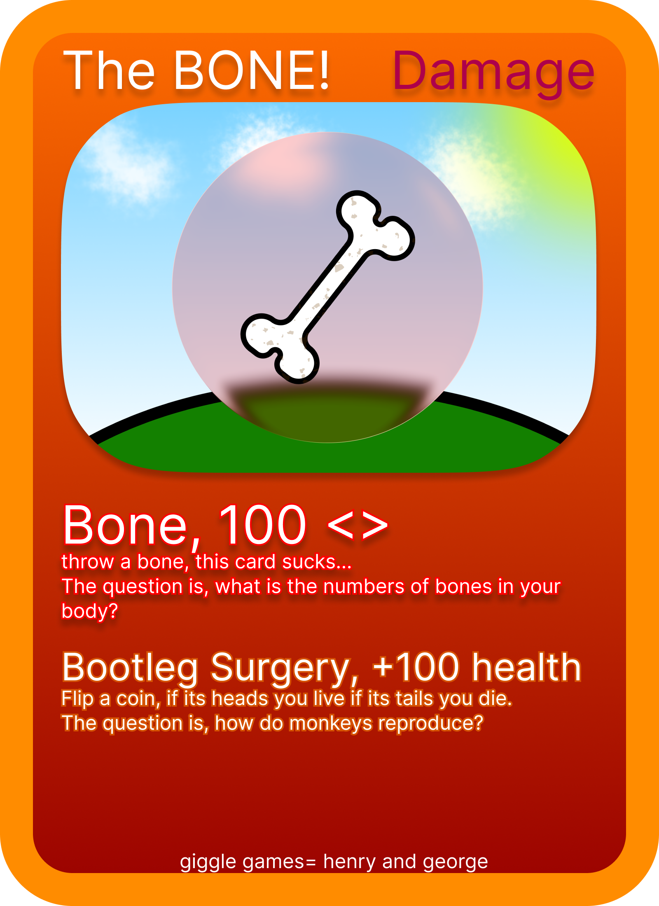
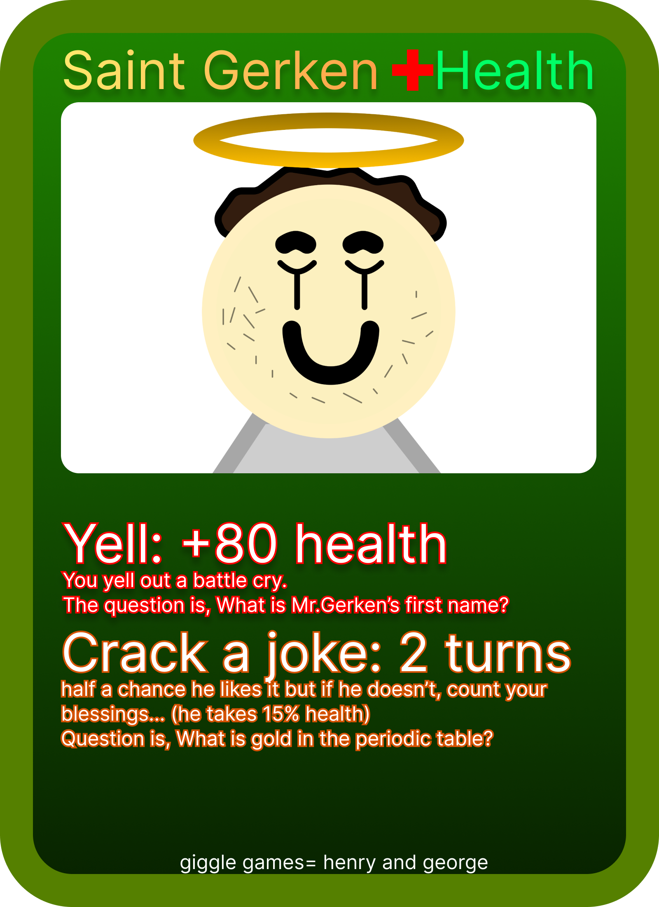
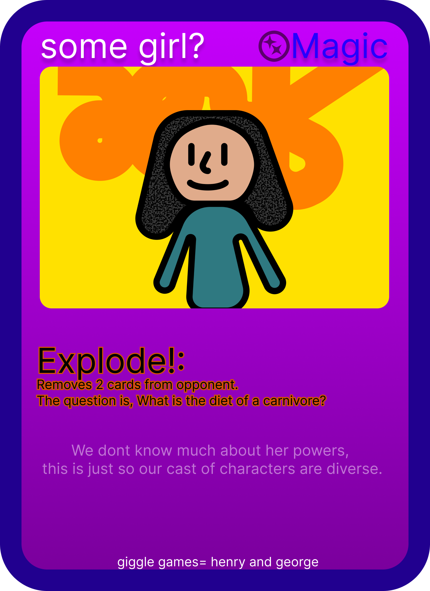

#  BoneyPlays: The Game That Friendship Ruined

Welcome to **BoneyPlays**, a highly sophisticated, meticulously balanced, and completely fair 1v1 card battler. 

*Just kidding.* This game is a  mess of bone-themed violence, devastating trivia questions, and blatant favoritism. If you lose, it's probably because I hardcoded a disadvantage against you.

## What is this?
It's kind of like Pokémon, but with bones, and also with high-stakes trivia, and sometimes a girl just wins because she gets better cards than you. You pick a color, you draw some cards, and you try to obliterate your opponent's HP before they can answer a question about the shape of a femur.

## 🃏 The Arsenal
A look into the cards.
Art by George, but all of these are made by Henry... :P

  
  
  

## Features
*   **Intense 1v1 Combat:** Whittle down your friend's 500 HP (or 1000 HP if you hate yourselves and want to be here all day).
*   **Trivia of Doom:** Did you want to just play a card? Too bad. Answer a question. Get it right, and you deal damage. Get it wrong, and you suffer the consequences (and public humiliation).
*   **A "Balanced" Deck:** We have damage cards. We have health cards. We have magic cards. We have a card that is literally just a shark tooth.
*   **Performance Mode:** For when your 2012 MacBook Air starts screaming because the 1,000+ floating background particles are melting the CPU.

## How to Play
0.  Download the Game: Clone this repository or download the ZIP file.
1.  Double click `index.html`.
2.  Type your names.
3.  Argue over who gets the cool cyan color.
4.  Fight to the death.

## Tech Stack
*   HTML, CSS, JavaScript.
*   Spite.
*   Whatever audio files were lying around on the desktop.
*   Some crackhead on my street...

---
*Remember: If you lose to The Big S, it's not a skill issue. It's a feature.*